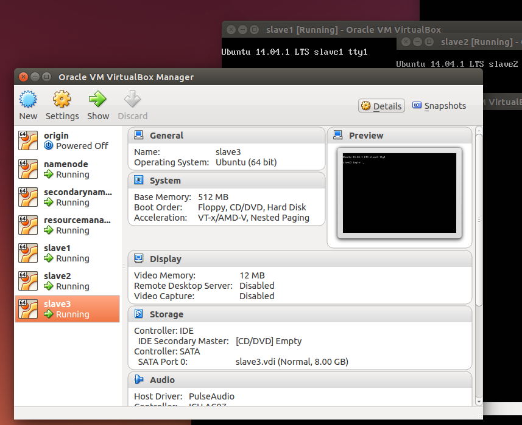

#Hadoop2.4安装、配置、使用指南#

鉴于Hadoop配置繁琐，网络上的资料鱼龙混杂，我们决定写一个经过验证可行的Hadoop安装、配置、使用指南，免除新手苦苦摸索的痛苦。本文会不断的完善，你可能需要前往[Hadoop2.4安装、配置、使用指南](https://github.com/yupengfei/HadoopSettings)获取最新版。有问题或者建议欢迎加QQ群(55958311)讨论。
##安装环境##

+ 桌面：[Ubuntu Desktop 14.04.1 64位](http://www.ubuntu.com/download/desktop/)
+ 服务器：[Ubuntu Server 14.04.1 64位](http://www.ubuntu.com/server)
+ [Hadoop 2.4.1](http://www.apache.org/dyn/closer.cgi/hadoop/common/)

##编译##

1. 下载Hadoop的源代码
2. 解压
//TODO 接下来交给伟大的philo

##单机运行##

##集群部署##
集群的构架为一个NameNode，一个Secondary NameNode，一个Resource Manager，三个Slaves节点。对应的IP分别为

| hostname           | IP             |
| ------------------ | -------------- |
| namenode           | 172.16.253.211 |
| secondarynamenode  | 172.16.253.212 |
| resourcemanager    | 172.16.253.213 |
| slave1             | 172.16.253.214 |
| slave2             | 172.16.253.215 |
| slave3             | 172.16.253.216 |

首先，安装一个虚拟机，在上面部署完成基础的操作系统。我们使用VirtualBox，过程如下：

1. 建立一个新的虚拟机

2. 下载Ubuntu Server，检验Md5

    md5sum ubuntu-14.04.1-server-amd64.iso

检验结果应该为ca2531b8cd79ea5b778ede3a524779b9。

3. 安装Ubuntu Server
  
 

4. 设置网络连接，更新操作系统

    cd /etc/network
    sudo vi interfaces

//TODO[vi编辑器手册]()

输入类似于

    auto lo
    iface lo inet loopback
    auto eth0
    iface eth0 inet static
    address 172.16.253.216
    netmask 255.255.255.0
    gateway 172.16.253.241
    dns-nameservers 114.114.114.114

:wq

运行

   sudo ifup eth0
   ifconfig

    

5. 设置ssh，使用root远程登录

首先开启root账号

    sudo passwd root

然后修改配置文件

    sudo vi /etc/ssh/sshd_config

修改28行

    PermitRootLogin without-password
    
为

   PermitRootLogin yes

:wq

重启ssh服务

    sudo service ssh restart

此时可以使用客户端登陆服务器

6. 升级系统

    sudo apt-get update

    sudo apt-get upgrade

7. 安装openjdk 7

    sudo apt-get install openjdk-7-jdk

8. 使用FileZilla连接server，修改profile文件，在开头添加

    export JAVA_HOME=/usr/lib/jvm/java-7-openjdk-amd64
    export HADOOP_HOME=/opt/hadoop-2.4.1
    export PATH=$PATH:$HADOOP_HOME/bin
    export PATH=$PATH:$HADOOP_HOME/sbin
    export HADOOP_MAPRED_HOME=${HADOOP_HOME}
    export HADOOP_COMMON_HOME=${HADOOP_HOME}
    export HADOOP_HDFS_HOME=${HADOOP_HOME}
    export YARN_HOME=${HADOOP_HOME}

9. 编译hadoop
  //TODO 应该是philo写的
  //mvn package -DskipTests -Pdist,native -Dtar
  //生成文件在hadoop-2.4.1-src/hadoop-dist/target/hadoop-2.4.1
  //

10. 修改/etc/hosts

添加
    
    172.16.253.211     namenode
    172.16.253.212     secondarynamenode
    172.16.253.213     resourcemanager
    172.16.253.214     slave1
    172.16.253.215     slave2
    172.16.253.216     slave3

11. 修改masters、slaves文件，hadoop配置文件

masters文件记录的实际上是secondary namenode的hostname，在hadoop-2.4.1/etc/hadoop下面新建masters文件，写入

    secondarynamenode
    
slaves文件默认存在，记录的是slaves节点的hostname，修改hadoop-2.4.1/etc/hadoop下面的slaves文件，改为

    slave1
    slave2
    slave3

修改core-site.xml文件，将configuration之间加入
    <property>
        <name>fs.defaultFS</name>
        <value>hdfs://namenode:9000</value>
        <final>true</final>
    </property>
    <property>
        <name>hadoop.tmp.dir</name>
        <value>/opt/tmp/hadoop-${user.name}</value>
    </property>
    <property>
        <name>io.file.buffer.size</name>
        <value>131072</value>
    </property>

修改hdfs-site.xml文件，在configuration之间加入
    <property>
        <name>dfs.namenode.name.dir</name>
        <value>file:/home/dfs/name</value>
    </property>
    <property>
        <name>dfs.datanode.data.dir</name>
        <value>file:/home/dfs/data</value>
    </property>
    <property>
        <name>dfs.replication</name>
        <value>3</value>
    </property>

修改yarn-site.xml文件，将configuration之间加入
    <property>
        <name>yarn.resourcemanager.address</name>
        <value>resourcemanager:9001</value>
        <description>The address of the applications manager interface in the RM.</description>
    </property>

    <property>
        <name>yarn.resourcemanager.scheduler.address</name>
        <value>resourcemanager:18030</value>
        <description>The address of the scheduler interface,in order for the RM to obtain the resource from scheduler</description>
    </property>

    <property>
        <name>yarn.resourcemanager.resource-tracker.address</name>
        <value>resourcemanager:18025</value>
        <description>The address of the resource tracker interface for the nodeManagers</description>
    </property>

    <property>
        <name>yarn.resourcemanager.admin.address</name>
        <value>resourcemanager:18035</value>
        <description>The address for admin manager</description>
    </property>

    <property>
        <name>yarn.resourcemanager.webapp.address</name>
        <value>resourcemanager:18088</value>
        <description>The address of the RM web application.</description>
    </property>

    <property>
        <name>yarn.nodemanager.aux-services</name>
        <value>mapreduce_shuffle</value>
    </property>
12. 创建.ssh文件夹，为ssh免登陆做准备
    
    cd
    mkdir .ssh
13. 使用FileZilla连接server，将编译完成的Hadoop拷入/opt目录
    

14. 关闭虚拟机，clone6个虚拟机

然后，分别进入六个虚拟机，修改hostname为其hostname然后重启

15. 设置ssh免登陆

16.开机，

17.检查运行情况

##文件上传、下载##

##NameNode失效测试##

##动态添加Slaves##

##Yarn编程模型##

